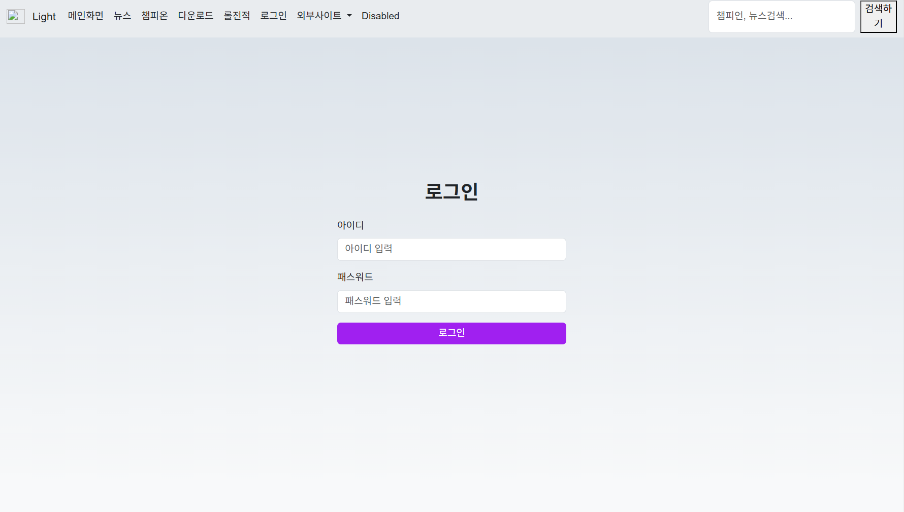
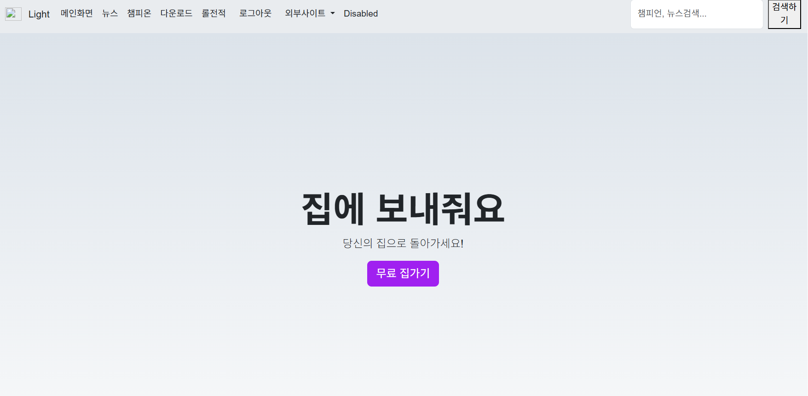
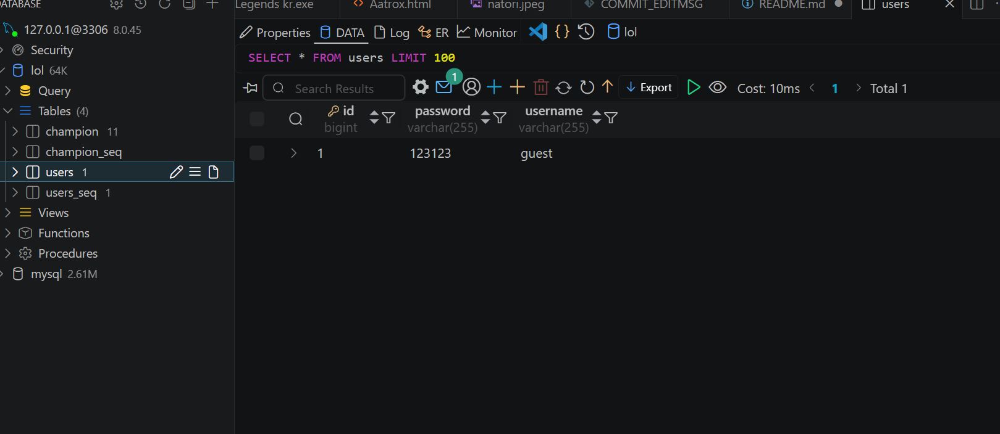
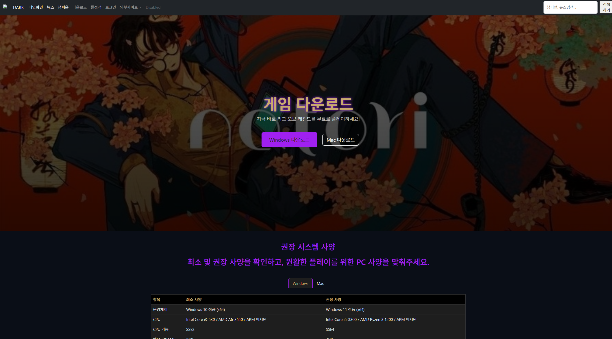
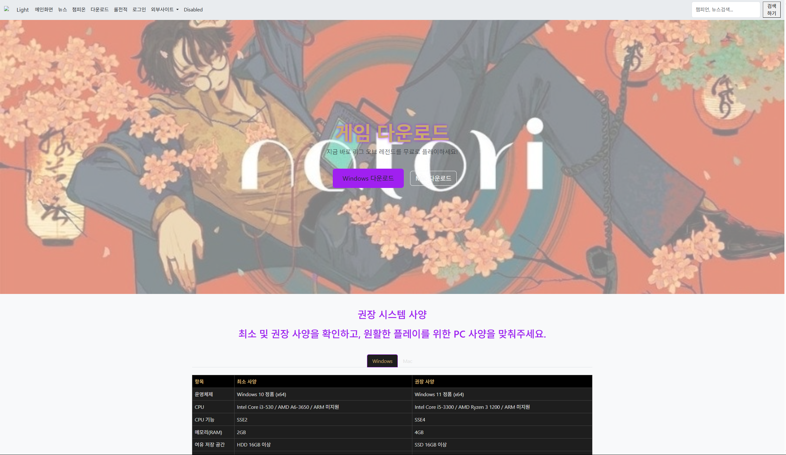

자바스크립트 / 10주차 / 20250634
< 로그인/로그아웃 >

실습1 >> 로그인 페이지 만들기
login 폴더 -> login.html

실습2 >> 로그인 버튼 변경
 로그인 -> 로그아웃

  

실습3 >> 데이터 베이스 연동 //사용자 아이디&비밀번호

** 10주차 과제 **

>> 다운로드페이지 다크/화이트모드 적용
-> downlaod.css파일 변경
/* ── [추가] 테마 토글 버튼 (폰트 크기, 색상 등 ) ──────────────── */
#themeToggleBtn { font-size: 1.1rem; color: #fff; }
body.light-mode #themeToggleBtn { color: #212529; }
/* ── [추가] 라이트 모드 (다양한 색상 정보 ─────────────────────── */

body.light-mode { background-color: #f8f9fa; color: #212529;}
body.light-mode .navbar { background-color: #e9ecef !important; }
body.light-mode .navbar .navbar-brand,
body.light-mode .navbar .nav-link { color: #212529 !important; }
body.light-mode .hero { 
    background: linear-gradient(rgba(255,255,255,0.5), rgba(255,255,255,0.5)), url('../images/download-banner.jpg') center/cover; }
body.light-mode .card { background-color: #ffffff; color: #212529; border: 1px solid #dee2e6; }
body.light-mode .card-title { color: #212529; }
body.light-mode .card-text { color: #555; }

>> 적용 후 이미지
1. 다크모드

2. 화이트모드 + 뒷배경 이미지 블러처리
